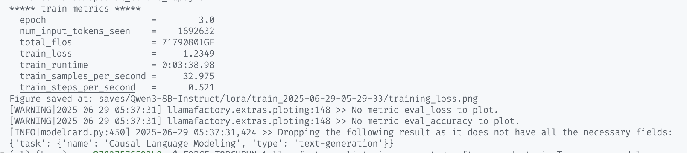
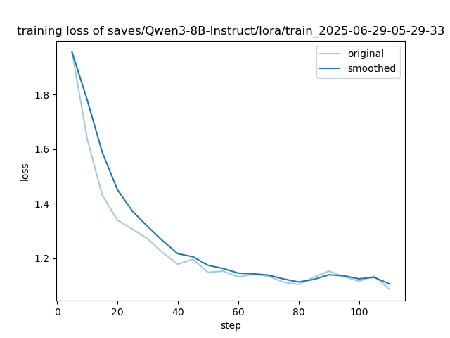
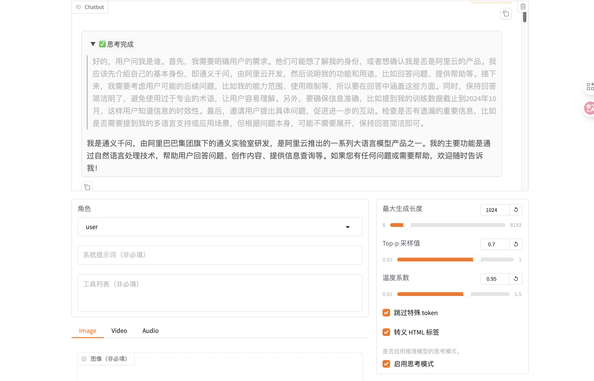

# LLama-factory 单机多卡微调Qwen-8B模型实战

[](https://swanlab.cn/@bsjiaoao/Qwen3-8B_finetuned_lmfy_sft/runs/b192me996kdovyabh1o22)

- 基础模型： [Qwen3-8B](https://huggingface.co/Qwen/Qwen3-8B)
- 微调后模型： Qwen3-8B-Medical
- 数据集： [delicate_medical_r1_data](https://modelscope.cn/datasets/krisfu/delicate_medical_r1_data)
- 微调方式：全参数微调， LoRA微调
- 算力： RTX 4090（24GB显存） * 8 分布式微调

> 如果需要进一步降低显存需求，可以使用Qwen3-0.6B模型，或调低`MAX_LENGTH`

## 准备工作

### 环境搭建

```bash
git clone --depth 1 https://github.com/hiyouga/LLaMA-Factory
```

安装相关环境：

```bash
cd LLaMA-Factory
pip install -e ".[torch,metrics,swanlab]"
```

### 模型准备

在项目目录下执行：

```bash
python qwen8b-demo.py
```

从Huggingface镜像网站上下载Qwen-8b模型到Cache里。

### 数据集准备

将`sft_r1_data_example.jsonl`移动到`LLaMA-Factory/data`目录下，在`dataset_info.json`文件中追加：

```json
"sft_r1_data":{
    "file_name":"sft_r1_data_example.jsonl"
  }
```

## 训练工作

### 配置训练参数

查看项目目录下`training.yaml`文件，更改模型路径，数据集路径，微调类型，可视化设置等参数。

```yaml
# train_lora_qwen3_8b.yaml

stage: sft
do_train: true

model_name_or_path: ../Cache里的模型Snapshots # 模型路径
template: qwen3 # 模型模板
trust_remote_code: true
finetuning_type: lora # 微调类型：[lora, qlora, p-tuning, adapter, full]

dataset_dir: ../LLaMA-Factory/data # 数据集目录
dataset: sft_r1_data # 数据集名称
cutoff_len: 2048
max_samples: 100000
preprocessing_num_workers: 16

output_dir: saves/Qwen3-8B-Instruct/lora/train_log # 输出目录
overwrite_output_dir: true

per_device_train_batch_size: 1
gradient_accumulation_steps: 8
num_train_epochs: 3.0
learning_rate: 5.0e-5 # 必须加小数点.0，不然会报错
lr_scheduler_type: cosine
warmup_steps: 0
max_grad_norm: 1.0

optim: adamw_torch
packing: false
enable_thinking: true
include_num_input_tokens_seen: true

fp16: true # 是否使用半精度训练
flash_attn: auto

logging_steps: 5
save_steps: 100
ddp_timeout: 180000000

# 可视化设置，使用swanlab前需先登陆
use_swanlab: true
swanlab_project: llamafactory
swanlab_run_name: Qwen3-8B-Instruct

# LoRA 配置
lora_rank: 8
lora_alpha: 16
lora_dropout: 0
lora_target: all
```

### 开始训练

```bash
FORCE_TORCHRUN=1 llamafactory-cli train ../llama_factory_demo/training.yaml # 配置为training.yaml路径
```

随后开始训练，结束时会输出如下信息：



可以在输出目录中找到训练loss的变化曲线图：



也可以到对应swanlab链接查看训练详细参数变化情况。

## 使用微调后模型

可以在LLaMa-Factory的webchat界面使用微调后的模型，具体执行以下命令：

```bash
CUDA_VISIBLE_DEVICES=0 llamafactory-cli webchat  --model_name_or_path /home/user/.cache/huggingface/hub/models--Qwen--Qwen3-8B/snapshots/...模型路径   --adapter_name_or_path /home/user/saves/Qwen3-4B-Instruct/lora/...训练阶段的输出路径  --template qwen  --finetuning_type lora
```

随后可以看到进入了chat界面：



微调后结果演示：

```
Question: 描述肝硬化晚期的临床表现，并分析这些表现如何影响患者的生活质量及预后。
Think: 好的，用户让我描述肝硬化晚期的临床表现，并分析这些表现如何影响患者的生活质量和预后。首先，我需要确认用户的需求。他们可能是医学生、医疗工作者，或者对肝硬化有了解但需要更详细信息的患者。用户可能希望了解肝硬化的严重症状，以及这些症状如何影响他们的日常生活和生存率。
接下来，我需要回忆肝硬化晚期的典型症状。肝硬化晚期，也就是肝功能严重受损的阶段，通常会出现门脉高压、脾肿大、腹水、食管胃底静脉曲张破裂出血、肝性脑病、肝肾综合征等。这些症状都是肝硬化进展到晚期的表现。
然后，要分析这些症状如何影响生活质量。比如腹水会导致患者感到不适，限制活动，增加感染风险。食管静脉曲张破裂出血可能危及生命，需要紧急处理，这会严重影响患者的生活质量。肝性脑病会导致认知功能下降，影响日常活动和工作，甚至需要长期护理。
关于预后，肝硬化晚期的死亡率很高，尤其是出现肝肾综合征或严重并发症时。患者可能需要依赖药物、透析或肝移植，这些治疗方式虽然能延长生命，但生活质量可能依然较低。同时，肝移植虽然有效，但需要合适的供体和手术风险，且术后需要长期免疫抑制治疗，这可能带来新的并发症。
用户可能还想知道是否有预防或改善的方法，但问题中没有提到，所以可能需要避免深入讨论，除非用户后续提问。此外，用户可能希望了解如何管理这些症状，但同样，问题主要集中在临床表现和影响上，所以需要保持回答的针对性。
需要确保信息准确，比如肝硬化晚期的分期和具体症状是否正确。同时，要使用通俗易懂的语言，避免过多专业术语，但必要时解释术语。例如，解释肝性脑病时，可以提到它影响大脑功能，导致意识障碍等。
最后，总结时要强调肝硬化晚期的严重性，以及及时治疗和管理的重要性，但根据问题，可能不需要给出治疗建议，而是分析症状的影响。确保回答结构清晰，先描述症状，再分析影响，最后总结预后。

answer:肝硬化晚期的临床表现及对患者生活质量与预后的影响如下：
一、肝硬化晚期的临床表现
门脉高压及脾功能亢进
脾肿大：脾脏代偿性增大，导致血小板减少（脾功能亢进），患者易出现出血倾向（如牙龈出血、皮肤瘀斑）。
腹水：由于门脉高压和低蛋白血症，腹腔积液增多，表现为腹部膨隆、下肢水肿，严重时需穿刺放液。
食管胃底静脉曲张：门脉高压导致食管胃底静脉曲张，破裂后可引发致命性大出血（呕血、黑便），是肝硬化晚期的主要死因之一。
肝功能衰竭
肝性脑病：肝功能严重受损，无法有效清除毒素（如氨），导致脑功能障碍，表现为意识模糊、嗜睡、昏迷。
黄疸：胆红素代谢障碍，皮肤和巩膜黄染，尿液深黄，常伴随瘙痒。
凝血功能障碍：维生素K依赖因子减少，导致出血倾向（如鼻出血、皮下瘀斑）。
肝肾综合征
肾功能衰竭：肝硬化晚期常合并肾功能不全，表现为尿量减少、血肌酐升高，严重时需透析治疗。
低血压与肾衰竭：肝硬化晚期患者易出现低血压和肾衰竭，需严格限制液体摄入并使用升压药物。
全身症状
营养不良：长期消化吸收障碍导致体重下降、肌肉萎缩。
内分泌紊乱：如男性乳房发育、性功能减退等。
二、对患者生活质量的影响
身体功能受限
活动能力下降：腹水、脾肿大、肝性脑病等导致患者无法正常活动，长期卧床增加感染风险。
疼痛与不适：肝区疼痛、腹水压迫感、静脉曲张破裂出血时的剧烈疼痛显著降低生活质量。
心理与社会功能受损
认知障碍：肝性脑病导致注意力不集中、记忆力下降，影响工作与社交。
抑郁与焦虑：慢性疾病和预后不佳易引发心理问题，需心理支持与药物干预。

```

## 相关工具

- [swanlab](https://github.com/SwanHubX/SwanLab)：开源、现代化设计的深度学习训练跟踪与可视化工具
- [transformers](https://github.com/huggingface/transformers)：HuggingFace推出的包含预训练文本、计算机视觉、音频、视频和多模态模型的库，用于推理和训练
- [LLaMa-Factory](https://llamafactory.readthedocs.io/zh-cn/latest/index.html): 简单易用且高效的大型语言模型（Large Language Model）训练与微调平台